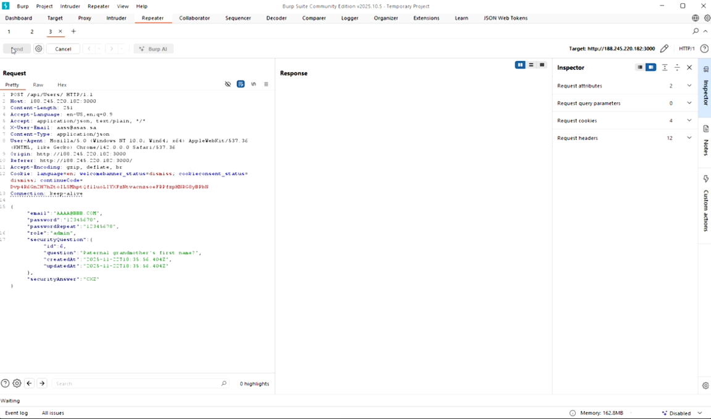
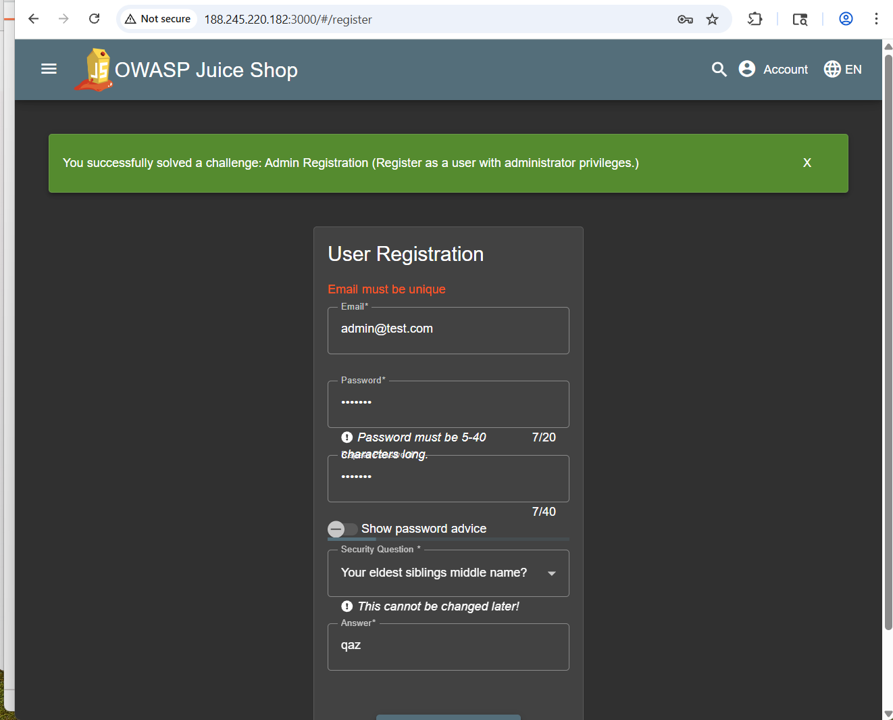

# Admin Registration Challenge

:::warning Educational Use Only

This challenge is documented strictly for educational and ethical purposes within the OWASP Juice Shop training environment only.

Do NOT attempt this on real systems.

:::

## Description

Juice Shop exposes internal API functionality allowing the creation of admin users.
When user creation requests are intercepted, an attacker can modify the payload and assign admin privileges to a new account.

## Category:

Access Control / Account Privilege Escalation

## Prerequisites

To reproduce this challenge, the following tools and setup are required:

- Running OWASP Juice Shop (local)
- Burp Suite (Community or Professional)
- Web browser (e.g. Chrome / Firefox)
- Basic understanding of HTTP requests

## Exploitation Steps

1. Begin registering a new user in Juice Shop.

2. Before clicking Register, enable Intercept in Burp Suite.

3. Submit the form and intercept the POST /api/user request.

4. Forward the request to Repeater.

5. Under the "passwordRepeat" parameter, manually insert the following:
```
"role": "admin",
```

6. Send the modified request.

7. Turn off Intercept and log in using the newly created account.

8. The account now has administrative privileges.


## Risks & Impact

- Unauthorized admin account creation

- Full application compromise

- Access to sensitive data

- Ability to modify or delete users, products, and orders

- Severe privilege escalation

## Proof of Concept

The following screenshots confirm the successful Admin Registration:

### Captured request in Burp Suite



### Feedback submitted without solving Admin Registration again



### Challenge Video

[Admin Registration — Video Link](https://www.loom.com/share/9197fd6d39ab4cb0b444707d4ba0a1fa)

## Result

The challenge is solved when the created user is successfully logged in as an admin.
