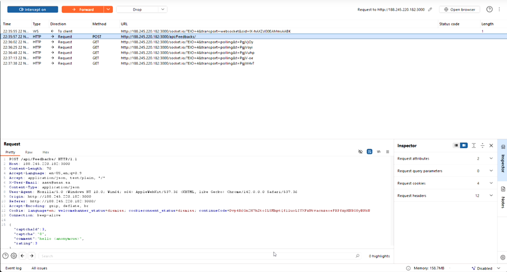
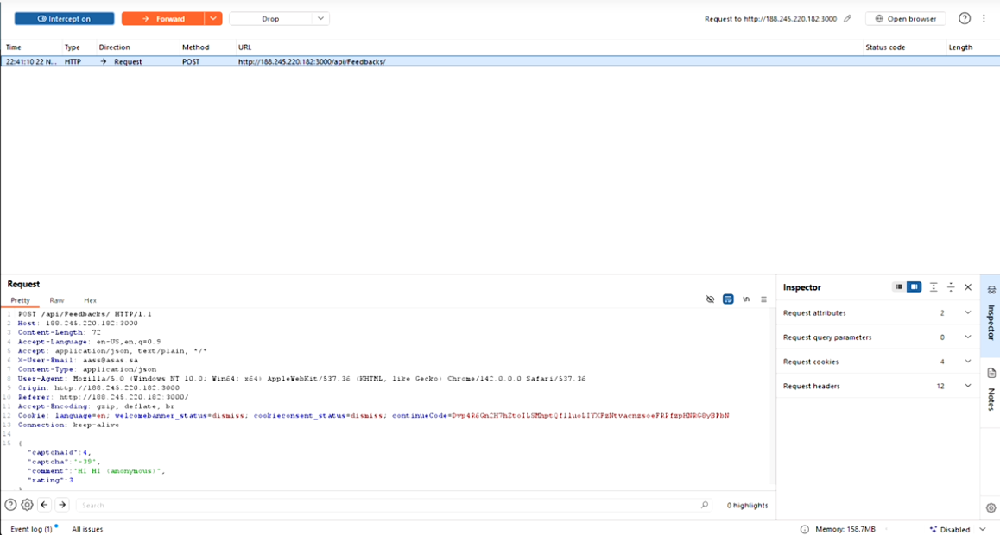
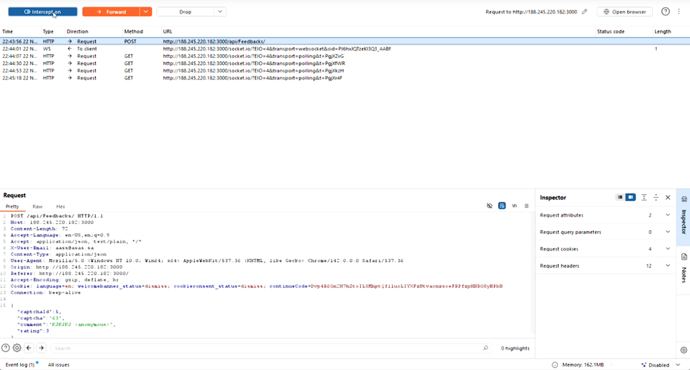
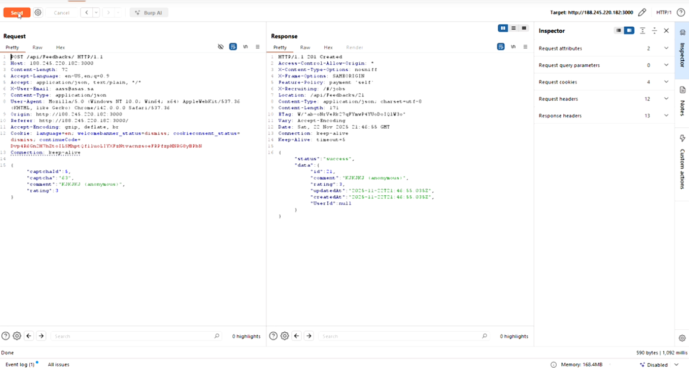
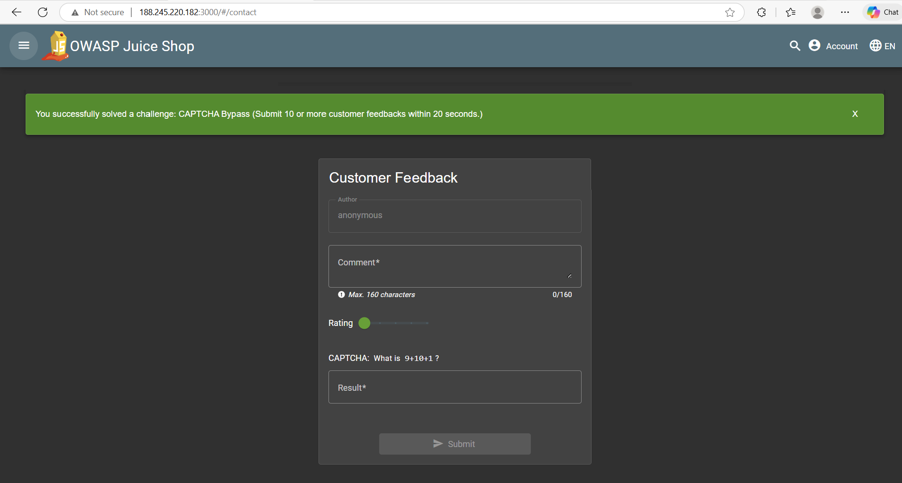

# CAPTCHA Bypass Challenge

:::warning Educational Use Only
This challenge is documented strictly for educational and ethical purposes within the OWASP Juice Shop training environment only.

Do NOT attempt this on real systems.
:::

## Description

The OWASP Juice Shop uses a CAPTCHA system to prevent automated abuse of the feedback form.
However, the CAPTCHA validation can be bypassed by intercepting and replaying the original request.

This makes it possible to submit feedback multiple times without solving the CAPTCHA again.

## Category

Input Validation / Bot Prevention Failure

## Prerequisites

To reproduce this challenge, the following tools and setup are required:

- Running OWASP Juice Shop (local)
- Burp Suite (Community or Professional)
- Web browser (e.g. Chrome / Firefox)
- Basic understanding of HTTP requests

## Exploitation Steps

1. Log out and go to the Customer Feedback section.

2. Write a comment, choose a rating, and solve the CAPTCHA only once.

3. Enable Intercept in Burp Suite and click Submit.

4. In Burp, capture the POST /api/feedback request.

5. Send this request to Repeater.

6. Back in the browser, write another comment but do not solve the CAPTCHA.

7. Instead, repeatedly click Send in Repeater to bypass the CAPTCHA.

8. Each repeated request is accepted successfully despite not solving the CAPTCHA image again.

## Risks & Impact

- Automated spam through mass feedback submissions

- CAPTCHA becomes ineffective

- Bots can abuse forms and generate noise

- Potential for automated large-scale attacks

## Proof of Concept

The following screenshots confirm the successful CAPTCHA bypass:

### Captured request in Burp Suite

### Feedback submitted without solving CAPTCHA again

#### Challenge Video

[CAPTCHA Bypass —  Video Link](https://www.loom.com/share/9cfd73dc034749449d7da6e9cf5f9f26)

#### Result

The challenge is solved once multiple feedback entries are submitted without ever solving the CAPTCHA again.

